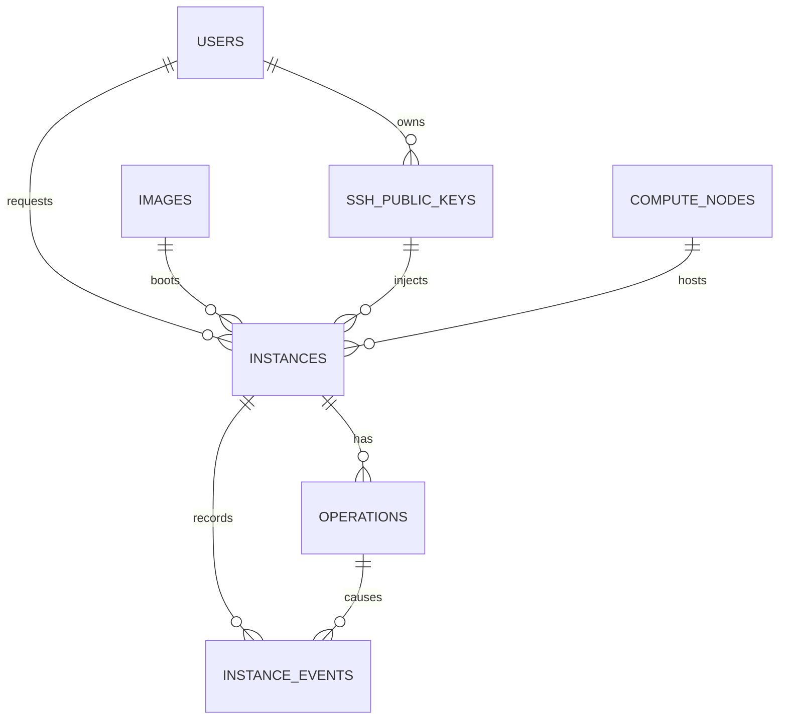

# Control-plane 데이터 모델과 보존 정책

## 이 문서의 목적

이 플랫폼의 MariaDB는 단순 VM 목록이 아니라 **사용자 요청부터 실제 libvirt 작업과 삭제 이력까지**
추적하는 control-plane 상태 저장소다. API가 응답하는 JSON, worker가 처리하는 queue, portal이 보여 주는
목록은 모두 이 모델을 기준으로 동작한다.

물리 schema의 기준은 Alembic migration
[`0001_initial_control_plane.py`](../control-plane/api/migrations/versions/0001_initial_control_plane.py)다.
`models.py`는 Python/SQLAlchemy 매핑이고, migration이 MariaDB에 실제 table·index·foreign key를 만든다.

## ERD



## Table별 책임

| Table | 핵심 열 | 책임 |
|---|---|---|
| `users` | `id`, `username`, `password_hash`, `role`, `is_active` | internal portal 계정과 admin/member 권한 |
| `ssh_public_keys` | `owner_id`, `name`, `public_key`, `fingerprint`, `is_active` | 사용자가 가져온 public key만 보관. private key는 절대 DB에 저장하지 않음 |
| `images` | `id`, OS 정보, `source_path`, `sha256`, `is_enabled` | GlusterFS 이미지 라이브러리의 검증된 catalog metadata. 이미지 blob 자체는 DB에 넣지 않음 |
| `compute_nodes` | 관리/provider IP, `allocatable_vcpus`, `allocatable_memory_mb`, `state` | scheduler가 참조하는 배치 후보와 보수적 resource limit |
| `instances` | owner/image/key/compute FK, 요청 자원, `monitoring_enabled`, 상태, IP, `deleted_at` | 한 VM의 desired state·실제 배치·생명주기를 보관하는 원장 |
| `operations` | `instance_id`, CREATE/DELETE, PENDING/RUNNING/SUCCEEDED/FAILED, `attempts` | HTTP 요청과 오래 걸리는 worker 실행을 분리하는 durable queue |
| `instance_events` | 이전/다음 상태, message, operation FK, 시각 | 사람이 읽을 수 있는 상태 전이·오류 audit trail |
| `alembic_version` | 적용 revision | domain data가 아니라 현재 DB schema version을 기록하는 Alembic 관리 table |

`alembic_version`을 제외하면 domain table은 7개다. 그래서 MariaDB의 `SHOW TABLES`에는 총 8개가 보인다.

## 실제 외래키와 무결성 규칙

MariaDB migration은 다음 foreign key를 만든다.

```text
ssh_public_keys.owner_id       → users.id
instances.owner_id             → users.id
instances.image_id             → images.id
instances.ssh_public_key_id    → ssh_public_keys.id
instances.assigned_compute_id  → compute_nodes.id
operations.instance_id         → instances.id
instance_events.instance_id    → instances.id
instance_events.operation_id   → operations.id
```

중요한 unique constraint도 의도적인 설계다.

- `users.username`: 같은 portal 계정 중복 방지
- `ssh_public_keys.fingerprint`: 같은 public key의 중복 등록 방지
- `(ssh_public_keys.owner_id, name)`: 한 사용자가 같은 key 이름을 중복 등록하지 못하게 함
- `instances.active_name`: 삭제되지 않은 VM 이름만 유일하게 보장

`instances.name`은 이력 조회용 일반 이름이고, `active_name`이 실제 unique key다. 삭제가 성공하면
worker는 `active_name = NULL`, `deleted_at = 현재 시각`, `status = DELETED`로 바꾼다. 따라서 같은
사용자든 다른 사용자든 과거 이름은 보존하면서 새 VM에서 이름을 재사용할 수 있다.

`instances.monitoring_enabled`는 guest OS node exporter 설치 여부를 기록한다. 현재 정책에서
새 VM은 자동으로 `true`가 되며, 이전 정책에서 생성된 VM은 실제 설치 여부를 보존하기 위해
값을 소급 변경하지 않는다. VM별 target은 별도 table에 중복 저장하지 않는다. provider IP와
lifecycle의 source of truth가 이미 `instances`이므로, Prometheus HTTP service discovery가
`ACTIVE + monitoring_enabled + provider_ip` 조건을 API에서 직접 읽는다.

## 생성·삭제 transaction과 상태 전이

```text
POST /v1/instances
  └── 한 DB transaction으로 생성
        instances(REQUESTED)
        operations(CREATE, PENDING)
        instance_events(생성 요청 기록)

worker
  └── PENDING operation을 행 잠금으로 claim
        SCHEDULING → PROVISIONING → WAITING_FOR_IP → ACTIVE
                         └────────────────────────────→ ERROR

DELETE /v1/instances/{id}
  └── operations(DELETE, PENDING)
        ACTIVE → DELETE_REQUESTED → DELETING → DELETED
```

API는 HTTP 요청 안에서 Ansible을 실행하지 않는다. `202 Accepted`를 반환한 뒤 worker가 scheduler와
Ansible을 호출한다. 그래서 browser가 닫혀도 operation·error·event가 DB에 남고, portal은 polling으로
상태를 다시 보여 줄 수 있다.

현재 lab은 worker 한 개만 실행한다. MariaDB 10.5 호환성을 위해 일반 `FOR UPDATE` 행 잠금을 사용한다.
다중 worker로 확장할 때는 DB 버전에 맞는 `SKIP LOCKED` 또는 별도 queue/broker 전략을 다시 설계해야 한다.

## Soft delete와 archive/purge 확장

현재 구현은 VM 삭제 때 `instances` 행을 지우지 않는 soft delete다. 최근 삭제 기록은 장애 분석, 사용자
문의, operation 오류 확인에 필요하며, `operations`·`instance_events`와의 관계도 그대로 유지된다.

운영 확장에서는 삭제 즉시 별 table로 옮기지 않고 다음 retention policy를 둔다.

| 기간 예시 | 저장 위치 | 목적 |
|---|---|---|
| 삭제 후 0–90일 | 운영 table의 `DELETED` 행 | 복구·감사·장애 분석 |
| 90일–1년 | `instance_archives`와 event archive 또는 별도 log store | 운영 조회 성능과 이력 보관의 분리 |
| 보존 기간 만료 | purge batch | 정책에 따른 영구 파기 |

이 lab에는 archive batch를 구현하지 않았다. 단순히 `deleted_instances`를 즉시 만드는 것보다,
foreign key·event 이력·재시도 작업을 함께 일관되게 옮기는 archive job을 별도 기능으로 설계하는 편이
안전하기 때문이다.

## 직접 확인할 SQL

control에서 아래처럼 MariaDB shell을 연다. 비밀번호·DB URL은 출력하거나 Git에 저장하지 않는다.

```bash
sudo mariadb private_cloud
```

```sql
-- schema 자체를 보고 싶을 때
SHOW CREATE TABLE instances\G
SHOW CREATE TABLE operations\G

-- active VM과 배치 node를 함께 조회할 때
SELECT
  i.name,
  i.status,
  c.name AS compute_name,
  i.provider_ip,
  i.requested_vcpus,
  i.requested_memory_mb,
  i.created_at
FROM instances AS i
LEFT JOIN compute_nodes AS c ON c.id = i.assigned_compute_id
WHERE i.deleted_at IS NULL
ORDER BY i.created_at;

-- 특정 VM의 worker 작업과 상태 이력을 볼 때
SELECT operation_type, status, attempts, error_message, created_at, completed_at
FROM operations
WHERE instance_id = '<INSTANCE_UUID>'
ORDER BY created_at;

SELECT previous_status, next_status, message, created_at
FROM instance_events
WHERE instance_id = '<INSTANCE_UUID>'
ORDER BY id;
```

## 코드를 읽는 추천 순서

1. [`models.py`](../control-plane/api/app/models.py)에서 domain object와 상태 상수를 읽는다.
2. migration에서 실제 foreign key·unique constraint·index를 확인한다.
3. [`main.py`](../control-plane/api/app/main.py)의 `request_instance()`가 한 transaction으로
   `instances`·`operations`·`instance_events`를 만드는 부분을 읽는다.
4. [`worker.py`](../control-plane/worker/worker.py)의 `claim_next_operation()`과 `process()`가
   상태를 어떻게 바꾸고 Ansible을 호출하는지 따라간다.
5. 마지막으로 portal JavaScript가 API response만 사용해 화면을 갱신하는 것을 확인한다.

이 순서로 보면 “웹 폼 → DB record → asynchronous worker → infrastructure change → 화면 갱신”이라는
control-plane의 전체 경계를 코드에서 추적할 수 있다.
