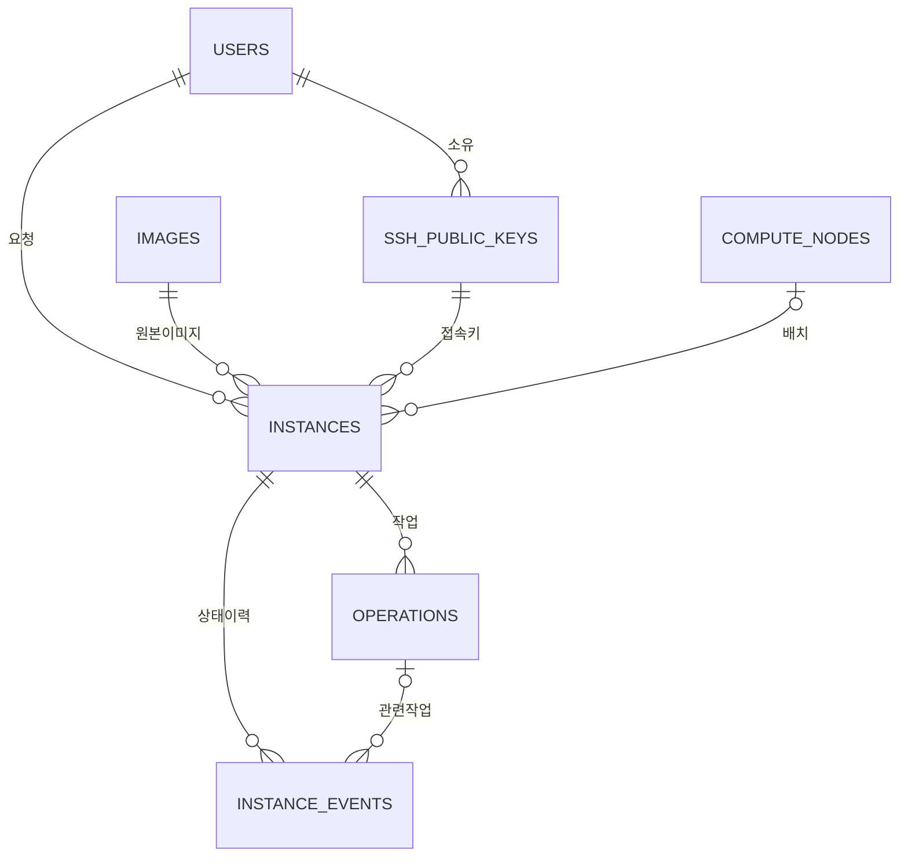

# 데이터 모델

MariaDB는 사용자 요청, VM 배치, 비동기 작업과 상태 이력을 저장합니다. 클라우드 이미지·VM 디스크 파일은 DB가 아니라 GlusterFS에 둡니다.

## 테이블과 관계

| 테이블 | 주요 열 | 책임 |
|---|---|---|
| `users` | `id`, `username`, `password_hash`, `role`, `is_active` | 포털 계정과 관리자·사용자 권한 |
| `ssh_public_keys` | `owner_id`, `name`, `public_key`, `fingerprint`, `is_active` | 사용자 공개키와 사용 여부. 개인키는 저장하지 않음 |
| `images` | `id`, `source_path`, `sha256`, `is_enabled` | 원본 이미지 경로·검증값·선택 가능 여부 |
| `compute_nodes` | 관리·provider IP, `allocatable_vcpus`, `allocatable_memory_mb`, `state` | 노드 등록 정보와 운영 화면의 배치 한도 |
| `instances` | 소유자·이미지·키·compute 참조, 요청 자원, 상태·IP, `monitoring_enabled`, `automation_enrolled`, `deleted_at` | VM 생명주기와 배치 결과 |
| `operations` | `instance_id`, `operation_type`, `status`, `payload`, `attempts` | 생성·삭제 비동기 작업과 실행 결과 |
| `instance_events` | `instance_id`, `operation_id`, 이전·다음 상태, `message`, 시각 | 상태 전이와 오류 이력 |
| `alembic_version` | `version_num` | 현재 적용된 DB 스키마 버전 |

업무 테이블 7개와 Alembic 관리 테이블 1개로, `SHOW TABLES` 결과는 총 8개입니다.



외래키는 Alembic이 생성합니다. `instances.assigned_compute_id`는 배치 전에는 비어 있을 수 있고, `instance_events.operation_id`는 특정 작업과 무관한 상태 갱신이면 비어 있을 수 있습니다.

## 스키마의 기준

[마이그레이션 디렉터리](../control-plane/api/migrations/versions)의 **전체 적용 순서**가 실제 DB 구조의 기준입니다. [models.py](../control-plane/api/app/models.py)는 SQLAlchemy 매핑이며, 최초 마이그레이션 하나만으로 현재 스키마가 완성되지 않습니다.

| 버전 | 변경 |
|---|---|
| `0001_initial_control_plane` | 초기 테이블·외래키·인덱스 |
| `0002_add_instance_monitoring` | VM 모니터링 여부 열 추가 |
| `0003_instance_enrollment` | 관리용 SSH 키 자동 편입 여부 추가 |
| `0004_default_monitoring` | 신규 VM 모니터링 기본값 활성화 |

기존 VM에는 exporter나 관리용 키가 없을 수 있으므로 관련 값을 일괄 변경하지 않습니다. 새 VM부터 현재 생성 정책을 적용합니다.

## 무결성과 삭제 정책

- `users.username`: 계정명 중복 방지.
- `ssh_public_keys.fingerprint`: 동일 공개키 중복 방지. `(owner_id, name)`은 사용자별 키 이름 중복 방지.
- `instances.active_name`: 삭제되지 않은 VM 이름을 사용자 전체에서 유일하게 유지.
- VM 삭제 성공 시 `active_name = NULL`, `deleted_at`과 `DELETED` 상태를 기록합니다. 이름을 재사용해도 과거 VM은 UUID로 구분됩니다.

VM 행을 즉시 지우지 않는 **논리 삭제**로 작업·오류 이력의 외래키 관계를 보존합니다. 운영 목록에서는 삭제된 행을 제외합니다.
키를 비활성화해도 이미 VM에 주입된 키가 자동으로 회수되지는 않습니다.
장기 보관 이력의 별도 이동·영구 삭제 작업은 구현하지 않았으며, 정해진 보존 기간이 있는 것처럼 표기하지 않습니다.

## 요청과 트랜잭션

생성 API는 하나의 트랜잭션에서 `instances(REQUESTED)`, `operations(CREATE/PENDING)`, 초기 이벤트를 기록한 뒤 `202 Accepted`를 반환합니다.
작업 처리기는 행 잠금으로 대기 작업을 선택하고 Ansible 결과에 따라 상태·이력을 갱신합니다. 현재 처리기는 한 개입니다.

작업 기록이 남는 것과 중단된 실행이 자동 복구되는 것은 다릅니다. 실행 중 처리기가 비정상 종료된 `RUNNING` 작업을 자동 회수·재시도하는 기능과 다중 처리기 운영은 현재 범위 밖입니다.
DB의 `ACTIVE`·`READY`는 생성 이력·배치 정책이며, exporter 관측값을 그대로 덮어쓰지 않습니다. 웹은 별도 관측 필드로 현재 접근 상태를 표시합니다.

## 직접 확인

control에서 `sudo mariadb private_cloud`로 접속한 뒤 읽기 전용 쿼리로 확인합니다.

```sql
SHOW TABLES;
SHOW CREATE TABLE instances\G

-- 삭제되지 않은 VM의 소유자·배치·요청 자원
SELECT i.name, u.username AS owner, c.name AS compute,
       i.status, i.provider_ip, i.requested_vcpus, i.requested_memory_mb
FROM instances AS i
JOIN users AS u ON u.id = i.owner_id
LEFT JOIN compute_nodes AS c ON c.id = i.assigned_compute_id
WHERE i.deleted_at IS NULL
ORDER BY i.created_at;

-- 최근 작업 결과: 같은 이름을 재사용해도 UUID로 구분
SELECT i.id, i.name, o.operation_type, o.status, o.error_message
FROM operations AS o
JOIN instances AS i ON i.id = o.instance_id
ORDER BY o.created_at DESC
LIMIT 10;
```

비밀번호 해시·DB 접속 문자열·초기 계정 비밀번호는 조회 결과 캡처나 Git 문서에 포함하지 않습니다.
